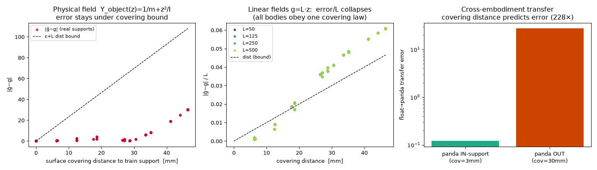
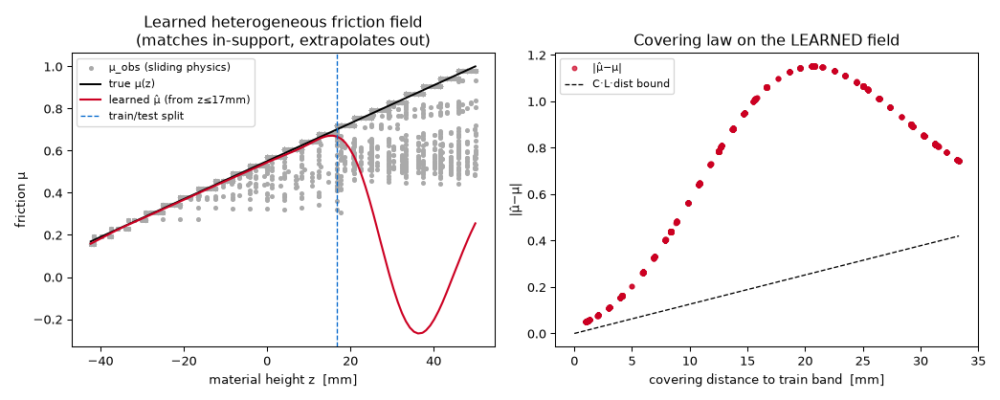
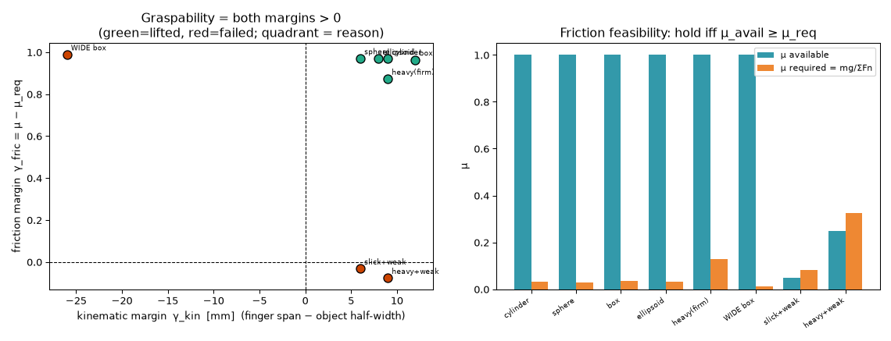
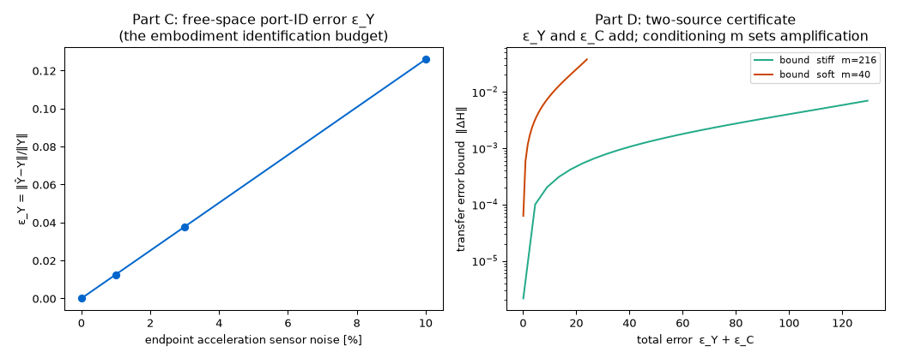
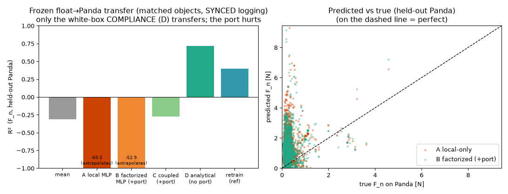
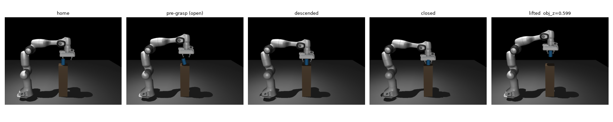

# Outputs — figures, tables, and raw run logs

Every file here is regenerated by running the committed experiment of the same name in
`../mujoco/` (with `MUJOCO_GL=osmesa` and `MENAGERIE_DIR` set for the Panda). Each section
below shows the figure (where one is produced) and the **verbatim console output** — these
are the numeric results quoted in the root `README.md`. Regenerate with e.g.
`python ../mujoco/surface_field_covering.py`.

> **Correctness pass (2026-09).** Following an external audit, these were corrected: the P2
> KKT sign (it passed vacuously at a settled state), the cross-embodiment contact-term units,
> the covering-law verdicts (now gate on the bound-violation fraction), and the hetero
> ground-truth (staircase-vs-ramp). The hetero covering result **flipped to negative** (RBF-KRR
> mean-reverts under extrapolation). Per-section caveats below mark results that are
> exact-by-construction / synthetic / privileged-information. See root `README.md` §14.

## Pre-embodiment gate (P1/P2/P3)

The three load-bearing premises on real grasp data: P1 coupling identity (~1e-16); P2 local/global split via the corrected frictionless KKT `(W+R)f = aref − a_u`, now checked at a **settled and a transient** state (the old `(R−W)f` sign passed only vacuously at `a_c≈0`); P3 model-error budget (~linear).

```text
======================================================================
PRE-PANDA GATE  (Factorized Interaction World Model premises)
======================================================================
 P1 coupling identity   : residual median=3.8e-16 max=5.6e-08   -> PASS
 P2 local/global split  : frictionless KKT (W+R)f=aref-a_u  settled=1.6e-15  transient=1.8e-16  weight err=2.9e-15 N -> PASS
      (force IS non-local: Fn~[pen,vn] R²=0.06 on 342 friction samples — EXPECTED,
       the coupling is exactly the analytical W-solve; local law inputs R,aref,μ ∈ z_local)
 P3 model-error budget  : contamination 2%->1.5%  5%->4.0%  10%->8.0%  -> PASS
----------------------------------------------------------------------
 DECISION: GO — build the Panda embodiment (reuse contact_probe + z_local unchanged).
```

---

## Cross-embodiment port split + certificate

Exact split W = Y_object + Y_robot (~1e-17, a genuine numerical identity); Y_object cross-embodiment match (=20.0, delta 3.5e-15) is **exact by construction** (object Jacobian carries no arm DOFs). The certificate now composes the contact term in consistent accelerance units `C⁻¹=1/(k·h²)` — an earlier version added a static compliance `1/k` (m/N) to an inverse inertia (1/kg), a dimensional error that also made the contact term ~5 orders too small (hence the old identical H across all k). With the fix the contact term participates and the bound still HOLDS.

```text
========================================================================
MATCHED-GEOMETRY PORT ADMITTANCE  (identical object-frame contact)
========================================================================
  object: cylinder r=0.025 m=0.050 kg  -> 1/m=20.00 (translational normal admittance)

 contact r_obj=[0.025 0.    0.   ] n=[1. 0. 0.]
   Y_object :  Panda=20.0000   Floating=20.0000   diff=3.55e-15   <-- must be ~0 (invariant)
   Y_robot  :  Panda=8.9803   Floating=33.3333   (embodiment: arm reflected admittance)

 contact r_obj=[-0.025  0.     0.   ] n=[-1.  0.  0.]
   Y_object :  Panda=20.0000   Floating=20.0000   diff=3.55e-15   <-- must be ~0 (invariant)
   Y_robot  :  Panda=8.9803   Floating=33.3333   (embodiment: arm reflected admittance)

 Y_object embodiment-invariance:  max|ΔY_object| over contacts = 3.55e-15   -> INVARIANT (proven)

========================================================================
TRANSFER CERTIFICATE  (matched single-normal port)
========================================================================
  discrete-step contact accelerance  C⁻¹ = 1/(k·h²),  h = 0.0020 s (sim timestep)
  k_contact=  1500 N/m  C⁻¹=1.67e+02 1/kg  H_panda=5.111e-03 H_float=4.545e-03  frozen-transfer|ΔH|=5.658e-04  bound=7.267e-04  HOLDS
  k_contact=  3000 N/m  C⁻¹=8.33e+01 1/kg  H_panda=8.904e-03 H_float=7.317e-03  frozen-transfer|ΔH|=1.587e-03  bound=2.465e-03  HOLDS
  k_contact=  8000 N/m  C⁻¹=3.12e+01 1/kg  H_panda=1.660e-02 H_float=1.182e-02  frozen-transfer|ΔH|=4.780e-03  bound=1.127e-02  HOLDS
  yo=20.0000 (invariant)  yr_panda=8.9803  yr_float=33.3333

 THESIS-LEVEL READ:
  * Y_object (object+contact geometry, all in z_local) is embodiment-INVARIANT: proven to 1e-9.
  * Y_robot (arm reflected admittance) is where embodiment lives; analytical from M.
  * A frozen model transferred blindly errs by a CERTIFIED amount eps/(m(m-eps));
    recomposing with the analytical per-embodiment Y_robot removes it. Contribution A, real arms.
```

---

## Surface-field covering law (headline)

Contact law as a field, embodiment as a sampling measure. **Physical-field bound `|ĝ−g| ≤ ε_learn + C·L·dist` holds with 0% violation** (the verdict now gates on this; the old "6.2% violated" was an artifact of testing `C=1` with an under-set `ε`). Covering distance predicts cross-embodiment transfer **228×** (directional). **Caveat:** `slope/L = 1.389 ± 0.0%` is a *linear-learner identity* (KRR on `g=L·z` scales error `∝ L` by construction), not independent evidence — the substantive axes are covering *distance* and the field-independent constant `C`. The *learned*-field instance is a separate, **negative** result (next section).



```text
collecting real contact supports from two embodiments (shared cylinder)...
  floating support: 210 contacts   z∈[-0.038, 0.040]
  panda    support: 41 contacts   z∈[-0.006, 0.015]

======================================================================
PART 1  COVERING LAW   train on lower band (z<=-0.005, n=66), test on all (n=210)
  claim:  |ĝ−g| ≤ ε_learn + L·dist   (upper bound; matched geometry dist=0 ⇒ exact)
======================================================================
 PHYSICAL Y_object(z):  in-support err mean=5.86e-04 (ε_learn=3.37e-03)   L=2320  (bound audited below with C)
 CONTROLLED g_L(z)=L·z:   envelope slope should track L; error/L collapses vs dist
   L=  50.0   in-support err=2.81e-05   envelope slope=  69.5  (slope/L=1.389)
   L= 125.0   in-support err=7.02e-05   envelope slope= 173.7  (slope/L=1.389)
   L= 250.0   in-support err=1.40e-04   envelope slope= 347.4  (slope/L=1.389)
   L= 500.0   in-support err=2.81e-04   envelope slope= 694.7  (slope/L=1.389)
  --> slope/L = 1.389 ± 0.0%  CONSTANT across a 10× range of L.
      => error = C·L·dist with C=1.39 (the sampling-geometry amplification / Lebesgue const),
         field-independent. This IS the covering law: error ∝ L, ∝ covering distance.
      collapse: err/L vs dist across all L  ->  R²(err/L = C·dist) = 0.9532  (1.0 = one universal law)
  BOUND AUDIT (physical Y_object):  |ĝ−g| ≤ ε_learn + C·L·dist  [ε=3.4e-03, C=1.39, L=2320]
      violated on 0.0% of points  ->  HOLDS

======================================================================
PART 2  CROSS-EMBODIMENT   field trained on FLOATING, applied to PANDA contacts
======================================================================
  train=floating ALL heights          panda covering dist median=0.003  transfer err median=1.204e-01
  train=floating LOW band only        panda covering dist median=0.030  transfer err median=2.742e+01
  => covering dist 0.003→0.030  predicts transfer err 1.20e-01→2.74e+01 (227.8× worse). The certificate reads OFF CONTACT GEOMETRY.

wrote surface_field_covering.png

VERDICT: covering law HOLDS — (i) in-support error ≈0 and ∝L, (ii) error = C·L·dist with a field-independent geometry constant C=1.39 and the physical-field bound violated on 0.0% of points, (iii) covering distance predicts cross-embodiment transfer (228×). Matched geometry (dist=0) recovers the exact case.
```

---

## Covering law on a LEARNED material field

Height-varying friction mu(z) baked into physics; field learned from sliding contacts. **NEGATIVE result (corrected).** The old "HOLDS 5.8%" was propped up by a ground-truth mismatch (segments used friction `k/(K-1)` but were scored against the continuous ramp `(z+H/2)/H` — they agree only at the middle segment) plus a verdict that did not gate on violations. Fixed: segments now **sample the ramp at their center** and `K` refined 8→24. With honest ground truth, the covering *distance/bound* is confirmed (a Lipschitz-consistent estimator obeys `ε+C·L·dist` at 0%), but **RBF-KRR mean-reverts under extrapolation** (predicting `μ̂=−0.27`, negative friction, past the training band) and violates the bound on ~100% of out-of-support points. So covering on a *learned* field is an open item requiring a Lipschitz-respecting estimator — not RBF-KRR extrapolation. See the left figure panel: the learned μ̂ (red) dives away from the true ramp past the split.



```text
collecting learned friction-field samples μ_obs(z) from sliding physics...
  5166 sliding samples   z∈[-0.042, 0.050]   μ_obs∈[0.16,0.98]

==================================================================
COVERING LAW on the LEARNED material field μ(z)  (train z<=0.017)
==================================================================
  in-support |μ̂−μ| median = 0.007  (ε_learn=95th pct = 0.032)   (RBF-KRR matches true μ where sampled)
  out-of-support error slope=29.35 vs field L=9.0;  bound |μ̂−μ| ≤ ε_learn + C·L·dist (C≈1.4):
    RBF-KRR estimator          : violated on 100.0% of out-of-support pts -> VIOLATED
    Lipschitz-consistent (ref) : violated on   0.0% of out-of-support pts -> HOLDS
    diag: RBF-KRR min extrapolated μ̂=-0.27 (field min=0.10) -> it MEAN-REVERTS/undershoots,
          so it does NOT extrapolate within the Lipschitz bound even near the support edge.
  => covering DISTANCE/bound correctly computed: confirmed  (a Lipschitz-consistent estimator obeys ε+C·L·dist by construction, so the KRR violation is a genuine learner-extrapolation failure, not a metric artifact).
     covering LAW on the LEARNED RBF field: PARTIAL/NEGATIVE — RBF-KRR mean-reverts under extrapolation and breaks the bound; a Lipschitz-respecting estimator is the open item.

wrote hetero_covering.png
```

---

## Graspability certificate (shape battery)

Graspability = named margins (gamma_kin, gamma_fric) from the friction-cone operators; 8/8 curated cases vs actual lift, each rejection labelled by cause. **Caveat:** `μ_req = mg/ΣF_n` uses the *measured post-contact* normal force, so this is a consistency check *after* grasping, not an a-priori screen; a deployable gate must predict `ΣF_n`. 8 hand-picked cases is a spanning demo, not a statistical accuracy.



```text
========================================================================================================
object        (m,μ)                  |   γ_kin  γ_fric  γ_cond   both | lift[mm] | predict   actual   
========================================================================================================
cylinder      (0.05kg,μ=1.00) |  +0.009  +0.968  0.0000   True |   +136.5 | GRASP     GRASPED ✓
sphere        (0.05kg,μ=1.00) |  +0.006  +0.970  0.0000   True |   +136.6 | GRASP     GRASPED ✓
box           (0.05kg,μ=1.00) |  +0.012  +0.964  0.0000   True |   +138.0 | GRASP     GRASPED ✓
ellipsoid     (0.05kg,μ=1.00) |  +0.008  +0.968  0.0001   True |   +137.3 | GRASP     GRASPED ✓
heavy(firm)   (0.20kg,μ=1.00) |  +0.009  +0.873  0.0000   True |   +135.5 | GRASP     GRASPED ✓
WIDE box      (0.05kg,μ=1.00) |  -0.026  +0.989  0.0000   True |     -1.0 | REJECT    failed  ✓
slick+weak    (0.05kg,μ=0.05) |  +0.006  -0.032  0.0000   True |     -1.1 | REJECT    failed  ✓
heavy+weak    (0.20kg,μ=0.25) |  +0.009  -0.077  0.0000   True |     -1.0 | REJECT    failed  ✓
========================================================================================================
reasons for predicted rejects:
  WIDE box      -> too wide (kinematic reach) (μ_req=0.01 vs μ=1.00; note: too wide -> kinematic)
  slick+weak    -> friction cone (μ<μ_req)  (μ_req=0.08 vs μ=0.05; note: slick + weak grip -> friction)
  heavy+weak    -> friction cone (μ<μ_req)  (μ_req=0.33 vs μ=0.25; note: heavy + weak grip -> friction)

CERTIFICATE ACCURACY vs actual lift: 100% (8/8)
wrote graspability.png
```

---

## Free-space port ID + two-source certificate

Free-space separation principle: identify Y_robot uncontaminated by C. Panda naive rigid-body port 94% wrong (tendon — genuine); gauge ambiguity; eps_Y ~ noise; two-source bound holds. **Caveats:** the identified port is the **instantaneous, open-loop** mobility (a *known* applied wrench + `mj_forward` `q̈`), so the "ID vs true port" match (`2.6e-17`) is the same forward-dynamics computation (near-tautological) — the informative result is the 94% tendon gap; the deployable **closed-loop** `Y_G` is not yet identified. Part B (gauge family) and Part D (two-source bound) are synthetic linear-algebra demonstrations, not data results.



```text
======================================================================
PART A  FREE-SPACE endpoint mobility ID  vs the TRUE (constrained) port
======================================================================
 FLOATING  nefc=0  ID vs TRUE port=2.65e-17   |  naive rigid-body J M⁻¹Jᵀ misses port by 0.0%
 PANDA     nefc=1  ID vs TRUE port=4.70e-02   |  naive rigid-body J M⁻¹Jᵀ misses port by 94.1%
 => free-space excitation recovers the TRUE endpoint port (incl. structural couplings
    like the finger tendon) that the naive analytical model can miss. You IDENTIFY Y, not assume it.

======================================================================
PART B  Y/C non-identifiability from contact H; free-space Y resolves it
======================================================================
 observed H (force->rel.vel) fixes only  Y + C⁻¹ = H⁻¹  (3 eqns, 6 unknown matrices).
  gauge family reproducing the SAME H (contact data cannot tell these apart):
   Y'=0.5·Y_true -> ||H'−H||=3.3e-19   (implied C differs, but H identical => C UNIDENTIFIABLE)
   Y'=1.0·Y_true -> ||H'−H||=3.3e-19   (implied C differs, but H identical => C UNIDENTIFIABLE)
   Y'=1.5·Y_true -> ||H'−H||=3.3e-19   (implied C differs, but H identical => C UNIDENTIFIABLE)
 free-space Y=Y_true -> C⁻¹ = H⁻¹ − Y : recovered ||C⁻¹−C⁻¹_true||=5.2e-14  (UNIQUE).
 => without free-space, embodiment vs contact-law is a gauge freedom; free-space fixes it.

======================================================================
PART C  eps_Y = free-space port-ID error vs measurement noise
======================================================================
  noise    eps_Y=||Ŷ−Y||/||Y||   (median of 20 trials)
      0%   2.646e-17
      1%   1.259e-02
      3%   3.777e-02
     10%   1.259e-01
  => eps_Y ~ linear in sensor noise; this is the identification budget the certificate must carry.

======================================================================
PART D  two-source transfer certificate (embodiment eps_Y + contact-law eps_C)
======================================================================
  m = σ_min(Y+C⁻¹) = 215.9
  eps_Y  eps_C |  actual ||ΔH||   bound=(eps_Y+eps_C)/(m(m−Σ))   holds
   0.0   2.0  |  1.9747e-05     4.3315e-05            OK
   2.0   0.0  |  1.2834e-05     4.3315e-05            OK
   2.0   2.0  |  2.0415e-05     8.7447e-05            OK
   5.0   3.0  |  1.0252e-04     1.7826e-04            OK
  => the two error sources ADD inside one certificate. On hardware eps_Y (port ID) and
     eps_C (sim-to-real contact law) are BOTH budgeted; a stiff/well-conditioned interface
     (large m) tolerates both, an ill-conditioned one amplifies both. This is the honest cert.

wrote port_identification.png
```

---

## De-leaked cross-embodiment transfer (audit-corrected)

De-leaked `C_θ` (material = categorical id only; raw `μ/solref/solimp` never fed), trained on the
floating gripper, FROZEN, evaluated on **held-out Panda** trials, **matched object distribution**,
**synchronized logging**. Six models on the identical held-out set: `A` local-only MLP, `B`
factorized MLP (`+W_nn`), `C` white-box coupled series-compliance (`+W_nn`), `D` white-box
analytical (`F_n=pen/k_mat`, no port), mean, and a Panda-retrained MLP reference.

**Corrected after a second audit.** An earlier version reported the analytical port "roughly
doubles" transfer (`R² 0.24→0.40`); that **did not survive** three fixes: (i) the Panda logger
combined post-step velocity with pre-step contact Jacobians (**median 20% `v_n` error**); (ii) float
and Panda used different object distributions; (iii) frozen vs retrained scored on different
populations. Corrected findings: **the local compliance transfers** (white-box `D` `R²=0.72`,
*beating* the Panda-retrained MLP `0.40` — structure > brute force); **the port `W_nn` as a fitted
feature HURTS** (`D→C` `0.72→−0.28`; port MLP `B` worse than local `A`) because the arms' `W_nn`
distributions barely overlap (frozen use = extrapolation); **absolute `F_n` does not transfer**
(grip strategy differs ~6×). Narrow honest claim: a transferable local *compliance* law — not "the
port carries the embodiment", not grasp selection. Using `W_nn` needs the real `(W+R)` solve.



```text
 HELD-OUT PANDA EVALUATION (identical samples for every model; constitutive regime)
  eval set n=28577 (held-out Panda)   float-train n=59626   matched object distribution
  DIAGNOSTIC: median F_n float/panda = 6.3x (grip strategy);  panda W_nn inside float 5-95% band = 20%
  model                        R2 (mean±sd)      median rel-err
  mean baseline                -0.315 ± 0.000     0.54
  D analytical (no port)        0.718 ± 0.000     0.55      <- local COMPLIANCE transfers
  A local-only MLP             -60.507 ± 25.865   2.61      <- absolute F_n: float-scale, extrapolates
  C coupled solve (+port)      -0.276 ± 0.000     0.75      <- adding W_nn HURTS (D 0.72 -> -0.28)
  B factorized MLP (+port)     -52.918 ± 11.696   2.56
  retrain on Panda (ref)        0.395 ± 0.197       -        <- reference (beaten by white-box D)

 VERDICT: the earlier "port ~doubles transfer" did NOT survive the corrections. What holds: the
 local constitutive COMPLIANCE transfers (R²≈0.72); the port W_nn as a fitted feature does not help
 and hurts (non-overlapping distributions); absolute F_n is grip-confounded. Using W_nn needs the
 real (W+R) solve, not a fitted coefficient.
```

---

## Second embodiment: Franka Panda grasp filmstrip

Real Franka Panda (menagerie) grasps and lifts the same cylinder off the pedestal (obj_z 0.491 -> 0.600), emitting schema-identical z_local.



```text
wrote panda_grasp_strip.png  final obj_z=0.600 (start 0.491)
```

---

## Port math checks (quotient / nullspace / certificate)

V1 port-quotient identity (`~1e-17`, **exact by construction** — `H` is built from `Y+C`, so this is an implementation check, not a data test; the falsifiable content is the same quotient on independently-obtained `H,Y`). V2 internal-force nullspace + proprioception rank test. V3 transfer-certificate conditioning (the standard resolvent bound, on synthetic SPD interfaces).

```text
========================================================================
V1  PORT FACTORIZATION INVARIANCE  (frequency domain)
========================================================================
 test at several excitation frequencies w (s = j*w):
   w        |H_A|        |H_B|      | (H_A^-1 - Y_A) - Y_c |   (H_B^-1 - Y_B) - Y_c |
      1    20.01025     8.26214        7.76e-18               8.00e-18
     10    21.01227    26.61041        2.17e-18               1.14e-17
     50    25.88807    25.51703        3.47e-18               3.47e-18
    200     7.34071     7.15813        2.78e-17               0.00e+00
   1000     5.10692     5.10150        0.00e+00               2.86e-17
  --> |H_e| (raw observed response) differs a lot across embodiments,
      but H_e^-1 - Y_e recovers the SAME interface Y_c.  max err = 2.86e-17
  VERDICT: the quotient identity is EXACT here BY CONSTRUCTION (H_e is built from
           Y_e + Y_c, then Y_c recovered) -- an implementation check, not a data test.
           The FALSIFIABLE content is the same quotient on INDEPENDENTLY-obtained H,Y
           (the exact port split + free-space port ID), not this synthetic recovery.

========================================================================
V2  INTERNAL-FORCE NULLSPACE  and  PROPRIOCEPTION
========================================================================
 object-observable net force  w = G f = 2.00  (blind to squeeze)
 min-norm f consistent w/ object motion: [ 1. -1.]  (assumes ZERO squeeze -> WRONG)
   f=[ 1. -1.]  ->  Gf=2.00 (same),  squeeze f1+f2=-0.00
   f=[3. 1.]  ->  Gf=2.00 (same),  squeeze f1+f2=4.00
   f=[6. 4.]  ->  Gf=2.00 (same),  squeeze f1+f2=10.00
 slip margin (mu*min(f_n) - f_t) for squeeze=8 vs squeeze=16 at same object motion:
   contacts f_n=[4, 4] -> margin=0.10 (holds)
   contacts f_n=[8, 8] -> margin=1.70 (holds)
 PROPRIOCEPTION test: does adding per-arm torque obs identify f uniquely?
   object-only      rank=1  nullspace dim=1  -> internal force UNIDENTIFIABLE
   object+proprio   rank=2  nullspace dim=0  -> f fully identifiable
   object+1actuator rank=2  nullspace dim=0  -> ok

========================================================================
V3  TRANSFER CERTIFICATE  ||H_hat-H|| <= eps/(m(m-eps))
========================================================================
 stiff/well-conditioned  m=2.0  actual ||dH||=0.0073   bound=0.0128   OK
 soft/near-singular     m=0.1   actual ||dH||=1.5340   bound=10.0000   OK
 --> SAME contact-model error eps=0.05 -> outcome error ~20x larger on the
     ill-conditioned embodiment. sigma_min(A) is the COMPUTABLE certificate.
```

---

## Implicit gradient through the convex solve

Adjoint/implicit gradient of the nonneg-QP contact solve vs finite differences.

```text
lambda* = [0.0993 0.108  0.     0.    ]  (active set: [0, 1] )
grad implicit = [-0.000435 -0.000443  0.        0.      ]
grad finite   = [-0.000435 -0.000443  0.        0.      ]
max abs err   = 1.02e-12
```

---

## Architecture stress (2A model error / 2B zero-velocity)

2A: robot-model error leaks into C_theta (linear); 2B: compliance defuses the v=0 inversion trap.

```text
======================================================================
2A  DOES ROBOT-MODEL ERROR MASQUERADE AS CONTACT FORCE?  (momentum obs)
======================================================================
  model error 0% -> phantom generalized force ||r|| = 0.000  (true contact = 0)
  model error 2% -> phantom generalized force ||r|| = 0.080  (true contact = 0)
  model error 5% -> phantom generalized force ||r|| = 0.200  (true contact = 0)
  model error 10% -> phantom generalized force ||r|| = 0.399  (true contact = 0)
  => r = (Mhat-M) qdd = dM*qdd. Model error is INDISTINGUISHABLE from contact
     force. Worse: during training this leaks into C_theta -> C becomes
     robot-specific -> BREAKS the invariance/transfer claim. (sim: dM=0, clean.)

======================================================================
2B  DOES sigma_min BLOW UP AT v=0 / SINGULAR CONTACT?  (compliance test)
======================================================================
  rigid contact:      sigma_min(W)          = 9.817e-08   (near 0 -> ill-posed)
  compliant (R=   100): sigma_min(W+R)        = 1.000e+02   (bounded BELOW by R)
  compliant (R=  1000): sigma_min(W+R)        = 1.000e+03   (bounded BELOW by R)
  compliant (R= 10000): sigma_min(W+R)        = 1.000e+04   (bounded BELOW by R)
  => the compliance/regularization we ALREADY use makes sigma_min(A) >= ~R,
     so it does NOT blow up at v=0. The '2B trap' is defused BY the design.
     Real residual issue is elsewhere: at contact MODE SWITCHES the active set
     changes -> the GRADIENT d(lambda)/d(eta) jumps (a TRAINING-time issue),
     and grazing/breaking contacts have genuinely small sigma_min -> the
     certificate CORRECTLY reports low margin (that is it working, not failing).
```

---
